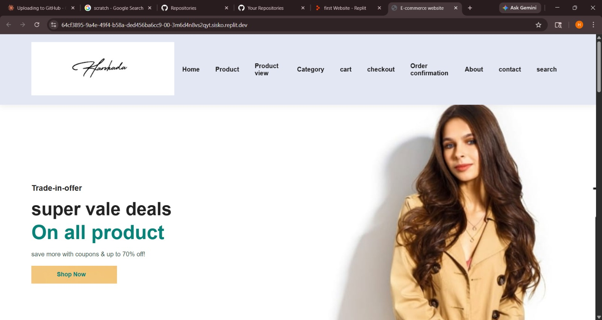

# 🛒 E-Commerce Website

A front-end **E-Commerce Website** built and hosted on **Replit**, designed to showcase an online shopping experience. This project demonstrates the fundamentals of web development including structured HTML layout, CSS styling, and JavaScript interactivity.

---

## 🔧 Tech Stack

- **HTML5** — Page structure and content
- **CSS3** — Styling and responsive design
- **JavaScript** — Dynamic behavior and interactivity
- **Replit** — Development and hosting platform

---

## ✨ Features

- 🛍️ Product listing / product view page
- ⚡ Interactive UI elements
- 🔒 Google reCAPTCHA integration for security
- 📊 Facebook Pixel tracking for analytics
- 💳 Stripe payment framework integration
- 📱 Responsive layout for different screen sizes

---

## 📁 Project Structure

```
📦 E-Commerce-Website
 ┣ 📄 E-Commerce_Website.html       → Main webpage file
 ┗ 📁 E-Commerce Website_files/     → Supporting assets (JS, CSS, iframes)
```

---

## 🚀 How to Run

1. Clone or download this repository:
   ```bash
   git clone https://github.com/harshadadeotare/E-Commerce-Website.git
   ```
2. Make sure the `E-Commerce Website_files/` folder is in the **same directory** as the HTML file
3. Open `E-Commerce_Website.html` in any modern web browser

---

## 🌐 Live Demo

Originally hosted on Replit:
[https://replit.com/@harshadadeotare/first-Website](https://replit.com/@harshadadeotare/first-Website)

---

## 📸 Preview



---

## 👤 Author

**Harshada Deotare**
- Replit: [@harshadadeotare](https://replit.com/@harshadadeotare)
- GitHub: [@harshadadeotare](https://github.com/harshadadeotare)

---

## 📝 License

This project is open source and available under the [MIT License](LICENSE).

